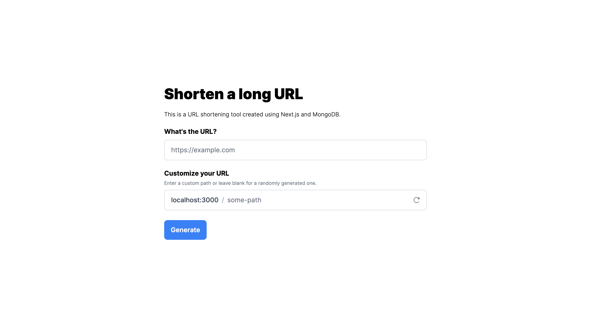

# URL Shortener

A simple URL shortener built with Next.js and MongoDB.

## Features

- Create short links for easy sharing
- Customize your link or use an auto-generated one
- Links automatically expire after 30 days

## Getting Started

1. Clone the repository
1. Install dependencies: `npm install`
1. Set up your MongoDB connection string in `.env.local`
1. Run the development server: `npm run dev`
1. Open [http://localhost:3000](http://localhost:3000) in your browser

## Future Improvements

- Enhance custom link creation:
  - Real-time availability checks
  - Unique random link generation

  Note: Currently, duplicate links are detected only upon submission, and users are notified if their chosen link is already in use.
- User history for created links
- Link previews using OpenGraph